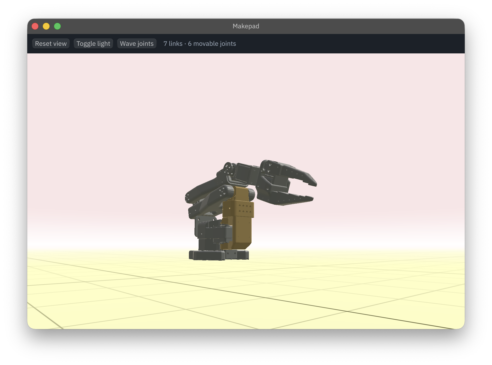

# Makepad URDF Viewer

An embeddable 3D URDF robot viewer built on [Makepad](https://github.com/makepad/makepad).
The crate is a **library first** — `RobotView` is a widget you drop into your own
Makepad app — with a small demo binary and an example that show how to drive it.

Runs on desktop (Metal/OpenGL) and in the browser (WebAssembly/WebGL).



## Features

- **URDF + STL loading**, with a visible fallback when a mesh is missing
- **Forward kinematics** for revolute, continuous and fixed joints
- **Orbit / pan / zoom camera** that pivots on the model, with near-vertical pitch
- **Joint control** from the host (`set_joint_angles`) or the keyboard
- **Daylight environment**: screen-space sky dome, ground plane and a grid that
  runs to the horizon, all themable from the DSL
- **Draggable key light** — alt+drag places the sun anywhere on the sphere
- **Geometry sharing** — repeated links (e.g. a 32-unit array) upload one buffer
- **No built-in model**: the widget shows whatever the host asks for

## Requirements

- Rust 1.75+
- **A sibling checkout of the patched makepad fork.** Upstream makepad `dev`
  cannot currently run 3D apps on WebAssembly — its own `examples/box3d` crashes
  — so `Cargo.toml` carries a `[patch]` pointing at `../makepad-dev-patched`.
  See [Patched makepad](#patched-makepad) below. Drop the patch once the fixes
  land upstream.

## Quick start

```bash
cargo run --release                 # demo app: Redbank III unit, 4x8 array, SO-100
cargo run --release --example embed -- data/so100.urdf data
```

## Controls

| Input | Action |
|---|---|
| Drag | Orbit (pivots on the model) |
| Shift+drag / right-drag / middle-drag | Pan |
| **Alt+click / alt+drag** | Place and move the sun |
| Wheel | Zoom |
| ←/→ | Select joint |
| ↑/↓ | Move the selected joint |
| A | Toggle animation |
| R | Reset pose and camera |
| L | Toggle the light |

Alt is deliberately the light's own modifier, so orbit, pan and the joint keys
keep working while the light is on.

## Using it in your app

Add the dependency (plus the `[patch]` from [below](#patched-makepad)):

```toml
[dependencies]
makepad-urdf-player = { git = "https://github.com/dorobot-org/makepad-urdf-viewer" }
```

### 1. Register the script module

```rust
impl AppMain for App {
    fn script_mod(vm: &mut ScriptVm) -> ScriptValue {
        makepad_widgets::script_mod(vm);
        makepad_xr::script_mod(vm);
        makepad_urdf_player::script_mod(vm);   // the widget's shaders + DSL types
        self::script_mod(vm)
    }
}
```

### 2. Place the widget

```rust
script_mod! {
    use mod.prelude.widgets.*
    use mod.widgets.*

    load_all_resources() do #(App::script_component(vm)){
        ui: Root{ main_window := Window{ body +: {
            viewer := mod.widgets.RobotView{
                // optional: load declaratively. Omit and call load_robot() instead.
                urdf: "data/so100.urdf"
                assets: "data"

                // optional: theme the environment
                show_grid: true
                sky_horizon: #xFFFBFB
                sky_zenith:  #xFAE5E7
                ground_color: #xFFFFC5
                grid_color:  #x6B6A3D
            }
        }}}
    }
}
```

### 3. Drive it

Everything goes through `RobotViewRef`, which handles the borrow for you:

```rust
use makepad_urdf_player::robot_view::RobotViewWidgetRefExt;

let viewer = self.ui.robot_view(cx, ids!(viewer));

viewer.load_robot(cx, "data/so100.urdf", "data")?;  // or "embedded" assets
viewer.set_joint_angles(cx, &[0.0, 0.5, -0.3, 0.0, 0.0, 0.0]);
let angles = viewer.joint_angles();
viewer.reset_view(cx);
viewer.set_light_on(cx, true);
viewer.set_light_angles(cx, 0.8, 0.6);   // azimuth, elevation (radians)
```

### 4. React to what it reports

```rust
fn handle_actions(&mut self, cx: &mut Cx, actions: &Actions) {
    let viewer = self.ui.robot_view(cx, ids!(viewer));
    if let Some((links, joints)) = viewer.loaded(actions) {
        log!("{links} links, {joints} movable joints");
    }
    if let Some((path, err)) = viewer.load_failed(actions) {
        error!("{path}: {err}");
    }
}
```

`examples/embed.rs` is a complete, runnable version of all of the above,
including driving the joints every frame — the hook a teleop UI or a dataset
player would use.

## API reference

Everything below is verified against the source; signatures are exact.

### Getting a handle

`RobotViewRef` is the handle you drive the widget through. It wraps the
internal borrow, so you never touch `borrow_mut::<RobotView>()`.

```rust
use makepad_urdf_player::robot_view::RobotViewWidgetRefExt;

let viewer = self.ui.robot_view(cx, ids!(viewer));
```

The extension trait is generated by makepad's `derive(WidgetRef)`, so the
import is required. `WidgetRef::as_robot_view()` is also available when you
already hold a generic `WidgetRef`.

A handle to a missing widget is not an error: every getter returns a sane
default (`joint_angles()` → empty, `is_light_on()` → `false`) and every setter
is a no-op. Only `load_robot` reports it, as `Err("RobotView not found")`.

---

### Loading models

#### `load_robot(&self, cx, urdf: &str, assets_dir: &str) -> Result<(), String>`

Loads (or replaces) the model. `assets_dir` is the directory mesh paths
resolve against.

```rust
viewer.load_robot(cx, "data/so100.urdf", "data")?;
viewer.load_robot(cx, "so100.urdf", "embedded")?;   // see below
```

Each `<mesh filename="...">` resolves in this order:

1. the **virtual asset registry**, keyed by *basename* — always consulted
   first, on every platform;
2. `assets_dir/<filename>` on disk, if it exists;
3. `assets_dir/<basename>` on disk.

`"embedded"` is a **convention, not a keyword**: the loader does not
special-case it. It is simply a directory name that will never exist, so
lookups fall through to the registry. Any string works if every asset is
registered.

A mesh that still can't be found is replaced with a small cube so the link
stays visible, and **the load still succeeds** — so `Ok(())` does not mean
every mesh resolved. Check the log, or assert on triangle counts the way
`tests/redbank_load.rs` does. `scale` on `<mesh>` is honoured.

The `Err` case means the URDF itself failed (missing, unparseable). The scene
is left untouched.

Loading is synchronous on the calling thread. A large model (the bundled 4×8
array is 65 links) blocks for a moment; geometry upload happens lazily on the
next draw.

#### `clear_robot(&self, cx)`

Drops the model and frees its GPU geometry, leaving an empty scene.

---

### Reacting to loads

Both are edge-triggered: they return `Some` only on the frame the event
occurred, so call them from `handle_actions`.

#### `loaded(&self, actions: &Actions) -> Option<(usize, usize)>`

`Some((links, movable_joints))` when a model finished loading — including
loads started by the `urdf` DSL property, which happen before your code runs.

#### `load_failed(&self, actions: &Actions) -> Option<(String, String)>`

`Some((path, error))` when a load failed.

```rust
fn handle_actions(&mut self, cx: &mut Cx, actions: &Actions) {
    let viewer = self.ui.robot_view(cx, ids!(viewer));
    if let Some((links, joints)) = viewer.loaded(actions) {
        self.status = format!("{links} links, {joints} joints");
    }
    if let Some((path, err)) = viewer.load_failed(actions) {
        error!("{path}: {err}");
    }
}
```

Underlying enum, if you prefer to match directly:

```rust
pub enum RobotViewAction {
    None,
    Loaded { links: usize, movable_joints: usize },
    LoadFailed { path: String, error: String },
}
```

---

### Posing joints

#### `set_joint_angles(&self, cx, angles: &[f32])`

Angles in **radians**, one per movable joint, in URDF declaration order.
Extra values are ignored; a short slice leaves the remaining joints alone.

**These are applied unclamped**, so recorded data renders exactly as recorded
even when it exceeds the URDF limits. If you want clamping, clamp before
calling. (The keyboard controls, by contrast, do clamp.)

```rust
let n = viewer.movable_joint_count();
let angles: Vec<f32> = (0..n).map(|i| (t + i as f32 * 0.6).sin() * 0.6).collect();
viewer.set_joint_angles(cx, &angles);
```

#### `joint_angles(&self) -> Vec<f32>`

Current angles, in the same order `set_joint_angles` expects — so it round-trips.

#### `movable_joint_count(&self) -> usize`

How many values `set_joint_angles` consumes. Revolute and continuous joints
are movable; fixed and prismatic joints are not.

---

### Camera

#### `reset_view(&self, cx)`

Re-frames the camera on the model's world-space bounds and resets the pose,
orbit angles and pan — the same thing the `R` key does.

Framing places the eye above the ground plane and keeps the horizon low. There
is no direct camera-set API; the camera is user-driven by design.

---

### Lighting

#### `is_light_on(&self) -> bool` / `set_light_on(&self, cx, on: bool)`

The sun: a small disc drawn in the sky that also acts as the key light. With
it off, the scene uses ambient plus a fixed fill.

#### `set_light_angles(&self, cx, yaw: f32, pitch: f32)`

Aim it. `yaw` is azimuth, `pitch` elevation, both in radians; pitch is clamped
to ±1.55 (just short of the poles, where azimuth degenerates). The full sphere
is reachable — the sun may sit behind the camera.

`RobotView::light_angles() -> (f32, f32)` reads them back.

Users can also place it directly: **alt+click** puts the sun under the cursor,
**alt+drag** moves it. Turning the light on from the UI parks it in the upper
right of the current view so there is something to grab.

---

### Animation

#### `is_animating(&self) -> bool` / `set_animating(&self, cx, on: bool)`

A built-in sinusoidal sweep of every movable joint, bounded by each joint's
limits. Convenient for demos; for real motion drive `set_joint_angles`
yourself from your own frame callback (see `examples/embed.rs`).

---

### Inspecting the model

`RobotView` (via `viewer.borrow()`) exposes the loaded model. The returned
`Ref` borrows from the handle, so bind the handle first:

```rust
let viewer = self.ui.robot_view(cx, ids!(viewer));
let borrowed = viewer.borrow();
if let Some(inner) = borrowed.as_ref() {
    let links = inner.robot().map(|r| r.num_links()).unwrap_or(0);
}
```


| Method | Description |
|---|---|
| `robot() -> Option<&Robot>` | The parsed model, or `None` if empty |
| `movable_joints() -> &[usize]` | Indices into `robot().joints` this widget drives |

`Robot` itself is a plain data type you can use without any widget:

```rust
use makepad_urdf_player::robot::{load_robot, ForwardKinematics};

let mut robot = load_robot("data/so100.urdf", "data")?;
ForwardKinematics::update(&mut robot);

robot.num_links();                  // usize
robot.num_movable_joints();         // usize
robot.get_joint_info(0);            // Option<(&str name, f32 angle, f32 lower, f32 upper)>
robot.get_link_transform(3);        // Option<Mat4>, world space, after FK
robot.bounds_world();               // (Vec3, Vec3) AABB with FK applied
robot.set_joint_angle(0, 0.5);      // clamped to the URDF limit
robot.set_joint_angle_unclamped(0, 9.0);
robot.reset_joints();
```

Call `ForwardKinematics::update` after changing angles directly; the widget
does this for you when you go through `set_joint_angles`.

`bounds()` unions link-**local** boxes and is only meaningful for models whose
links sit at the origin — use `bounds_world()` for framing.

---

### DSL properties

| Property | Type | Default | Description |
|---|---|---|---|
| `urdf` | String | `""` | Model to load on first draw; empty starts empty |
| `assets` | String | `""` | Directory the meshes resolve against, or `"embedded"` |
| `show_grid` | bool | `true` | Draw the ground grid |
| `sky_horizon` | color | `#xFFFBFB` | Sky at the horizon; the ground also hazes into this |
| `sky_zenith` | color | `#xFAE5E7` | Sky overhead |
| `ground_color` | color | `#xFFFFC5` | Ground fill |
| `grid_color` | color | `#x6B6A3D` | Grid lines |
| `width`, `height`, … | | | Standard makepad walk/layout properties |

Setting `urdf` is equivalent to calling `load_robot` on first draw, and reports
through the same action.

---

### Coordinates and units

- **URDF is Z-up; the scene camera is Y-up.** The conversion is applied inside
  the widget per instance — every API above is in URDF coordinates, so you
  never convert.
- Lengths are metres, angles radians, matching URDF.
- `bounds_world()` returns URDF-space corners.

## WebAssembly

```bash
cargo makepad wasm --no-threads build -p makepad-urdf-player --release
```

`--no-threads` avoids the COOP/COEP headers, so the output can be served from
static hosting. Do **not** pass `--strip` — it miscompiles this build.

The browser has no filesystem, so meshes are resolved through a virtual asset
registry. Embed them in the binary and register them before the first load:

```rust
use makepad_urdf_player::robot::set_virtual_assets;

let mut m = std::collections::HashMap::new();
m.insert("my_robot.urdf", include_bytes!("../data/my_robot.urdf").as_slice());
m.insert("base.stl",      include_bytes!("../data/base.stl").as_slice());
set_virtual_assets(m);
// then: viewer.load_robot(cx, "my_robot.urdf", "embedded")
```

Two things to know:

- Entries are keyed by **basename**, so a URDF path like `meshes/base.stl`
  finds the `base.stl` entry. Register every mesh the URDF references.
- It is backed by a `OnceLock`: **the first call wins and later calls are
  silently ignored.** Build one map with all your assets and register it once
  at startup, before the first load.

The registry works on desktop too, which is a convenient way to ship a
single-file binary.

## Patched makepad

Upstream `dev` cannot run 3D apps on wasm today. The sibling fork carries four
fixes this widget needs:

1. `windows[id_zero]` indexed before any window exists (panic on web init)
2. `ToWasmPaintDirty` unwrapping a `main_pass_id` that can be `None`
3. render-to-texture passes overwriting `camera_projection` even with
   `keep_camera_matrix` set — the "black viewport" cause
4. offscreen passes getting no depth attachment

Plus a widened camera pitch clamp (±1.45 → ±1.55 rad) for near-vertical views.
All are upstreamable; remove the `[patch]` block from `Cargo.toml` when they land.

## Features

| Feature | Default | Effect |
|---|---|---|
| `episode` | off | LeRobot parquet playback (pulls `arrow`/`parquet`, native only) |
| `profiling` | off | Performance output |

## Project structure

```
src/
├── lib.rs           # exports + script_mod registration
├── main.rs          # demo app (Redbank III unit / 4x8 array / SO-100)
├── robot_view.rs    # the RobotView widget — the library's main surface
├── error.rs         # error and warning types
├── episode.rs       # parquet episode loader (feature = "episode")
├── mesh.rs          # MeshData (CPU-side geometry)
├── profiling.rs
├── robot/
│   ├── model.rs     # Robot / Link / Joint, bounds, joint setters
│   ├── loader.rs    # URDF + STL loading, virtual asset registry
│   └── kinematics.rs
└── render/
    ├── mesh.rs
    └── draw.rs      # DrawRobotMesh, DrawGridPlane, DrawSceneComposite (sky)

examples/embed.rs    # minimal integration
data/                # demo models: Redbank III, SO-100
tests/               # headless load + framing checks
```

## Adding your own robot

1. Put the URDF and its STLs anywhere on disk.
2. `viewer.load_robot(cx, "path/to/robot.urdf", "path/to/assets")`.

Mesh paths inside the URDF resolve against the assets directory, by basename if
an exact path miss occurs. `scale` on `<mesh>` is honoured.

## Notes for integrators

- **Y-up vs Z-up**: URDF is Z-up, the scene camera is Y-up. The conversion is
  applied per-instance inside the widget; you always work in URDF coordinates.
- **`set_joint_angles` does not clamp.** It is the playback path, so recorded
  data renders exactly as recorded. The keyboard controls clamp to URDF limits.
- **Framing uses world-space bounds**, so models with translated joints orbit
  about themselves rather than an offset point.

## Dependencies

| Crate | Purpose |
|---|---|
| makepad-widgets / makepad-xr | UI framework, GPU rendering, camera |
| [urdf-rs](https://crates.io/crates/urdf-rs) | URDF parsing |
| [glam](https://crates.io/crates/glam) | Linear algebra |
| [stl_io](https://crates.io/crates/stl_io) | STL loading |
| [parquet](https://crates.io/crates/parquet) / arrow | Episode playback (optional) |

## License

MIT
